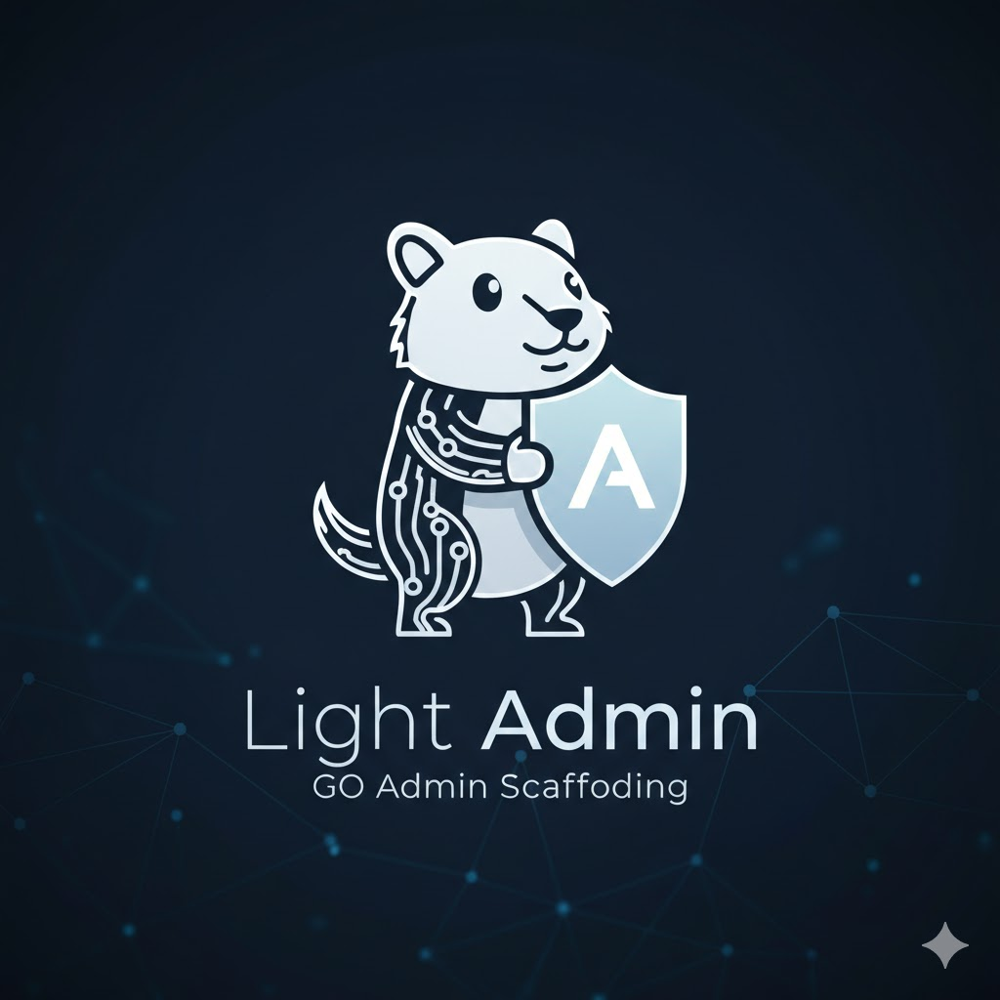

<div align="center">
  
  <h1>light-admin-ui</h1>

  
  
  
  

  <a href="https://github.com/top-system/light-admin-ui" target="_blank">
    
  </a>
</div>

---

## 项目简介

[light-admin-ui](https://github.com/top-system/light-admin-ui) 基于 Vue3、Vite7、TypeScript 和 Element-Plus 搭建的轻量级企业级后台管理前端模板。

## 项目特色

- **简洁易用**：无过度封装，易上手
- **系统功能**：提供用户管理、角色管理、菜单管理、部门管理、字典管理、系统配置、通知公告等功能模块
- **权限管理**：支持动态路由、按钮权限、角色权限和数据权限等多种权限管理方式
- **基础设施**：提供国际化、多布局、暗黑模式、全屏、水印等功能

## 项目源码

| 项目 | Github |
| --- | --- |
| light-admin-ui | [light-admin-ui](https://github.com/top-system/light-admin-ui) |

## 项目启动

- **环境准备**

| 环境类型 | 版本要求 | 备注 |
| --- | --- | --- |
| **Node.js** | `^20.19.0` 或 `>=22.12.0` | 推荐使用 LTS 版本（主版本为偶数） |
| **包管理器** | `pnpm >= 8.0.0` | 项目使用 pnpm 作为包管理器 |
| **开发工具** | [Visual Studio Code](https://code.visualstudio.com/Download) | 推荐安装 Vue、TypeScript 相关插件 |

- **快速开始**

```bash
# 克隆代码
git clone https://github.com/top-system/light-admin-ui.git

# 切换目录
cd light-admin-ui

# 安装 pnpm
npm install pnpm -g

# 设置镜像源(可忽略)
pnpm config set registry https://registry.npmmirror.com

# 安装依赖
pnpm install

# 启动运行
pnpm run dev
```

## 项目部署

执行 `pnpm run build` 命令后，项目将被打包并生成 `dist` 目录。接下来，将 `dist` 目录下的文件上传到服务器 `/usr/share/nginx/html` 目录下，并配置 Nginx 进行反向代理。

```bash
pnpm run build
```

以下是 Nginx 的配置示例：

```nginx
server {
    listen      80;
    server_name localhost;

    location / {
        root   /usr/share/nginx/html;
        index  index.html index.htm;
    }

    # 反向代理配置
    location /prod-api/ {
        # 请将 your-api.example.com 替换为您的后端 API 地址，并注意保留后面的斜杠 /
        proxy_pass http://your-api.example.com/;
    }
}
```

## 本地Mock

项目支持本地 Mock 接口，修改文件 `.env.development` 的 `VITE_MOCK_DEV_SERVER` 为 `true` 即可启用。

## 提交规范

执行 `pnpm run commit` 唤起 git commit 交互，根据提示完成信息的输入和选择。
